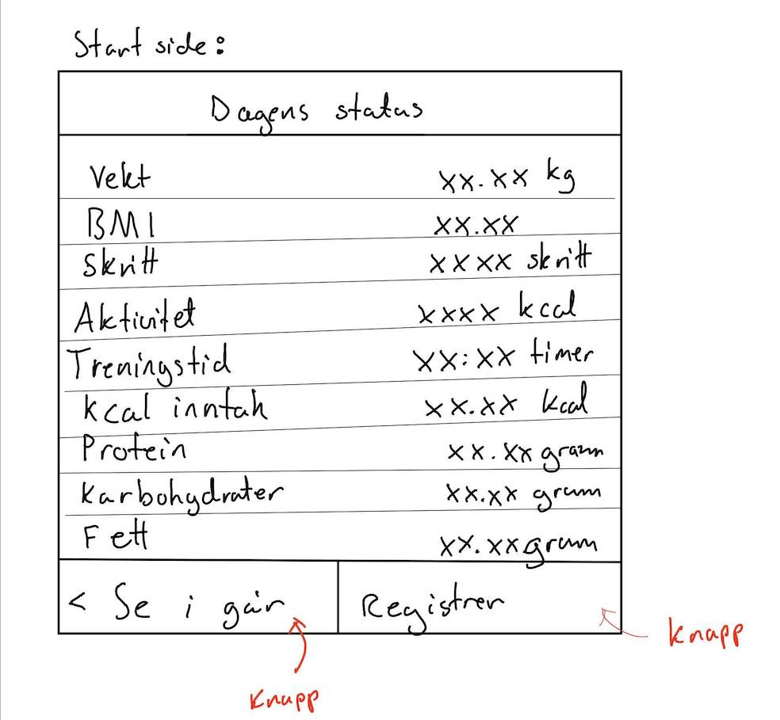
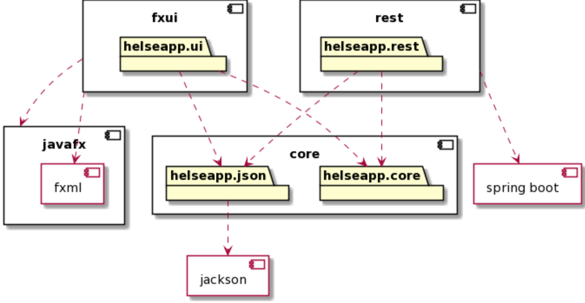
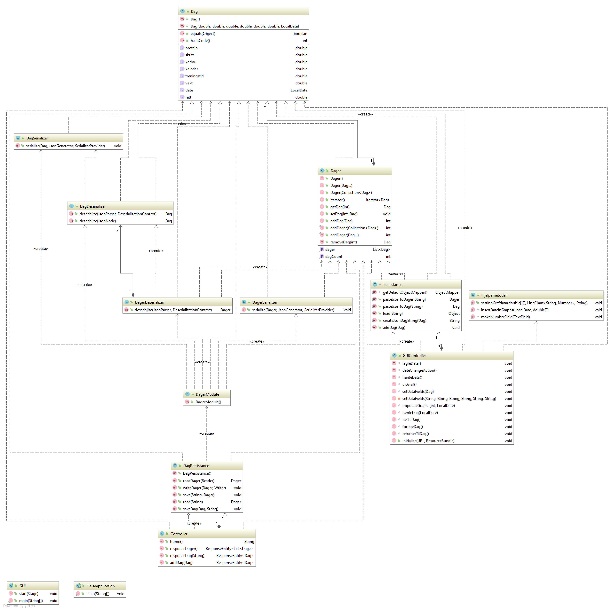
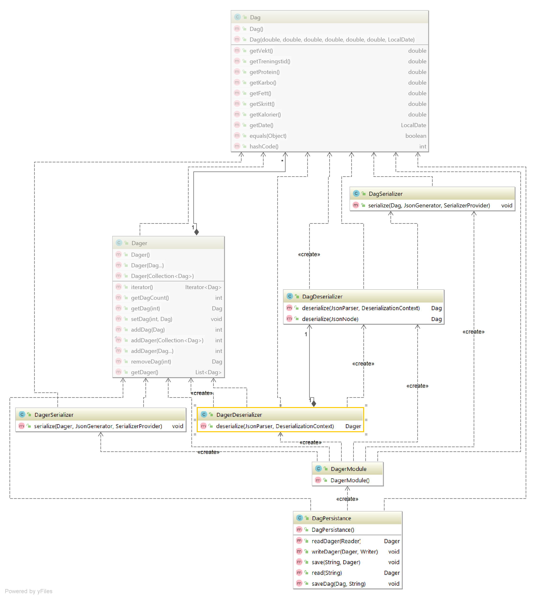
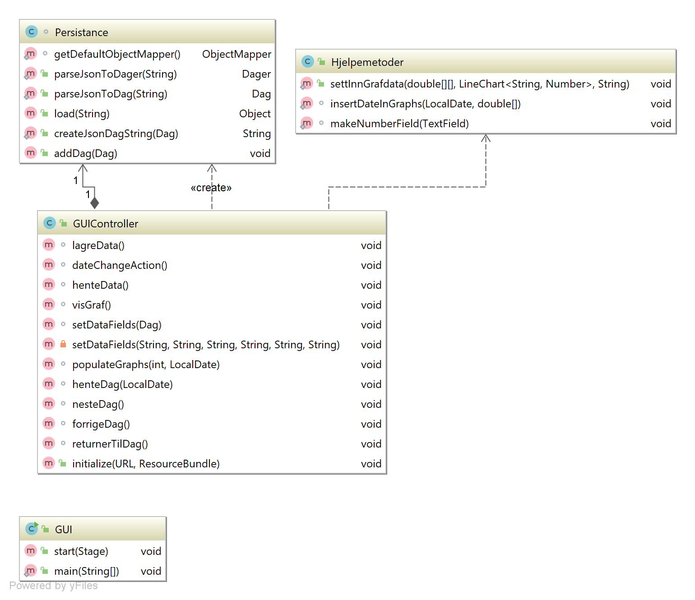
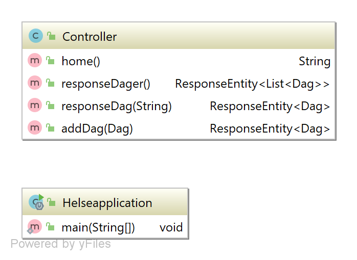

# Helseapp
Dette er en app for å registrere og skaffe oversikt over ulike helsedata, 
slik som vekt, høyde,  skritt, treningstid, proteininntak, karbohydratinntak 
og fettinntak. 

 

## 1. Brukerhistorier:
1. Som bruker ønsker jeg å registrere vekten min slik at jeg kan hente den frem senere
2. Som bruker ønsker jeg å registrere data for en valgt dato slik at jeg kan ha en historisk oversikt
3. Som bruker ønsker jeg å få en oversikt over vekten min for en gitt tidsperiode slik at jeg kan se fremgang
4. 5: Som bruker ønsker jeg å se en oversikt over alle dataene mine for en selvdefinert tidsperiode slik at jeg kan ha oversikt over utviklingen min
5. Som bruker ønsker jeg å kunne klikke meg fram og tilbake mellom dager samt å returnere til datoen i dag

 

## 2. Mocukup
En mockup av hvordan vi så for oss at hovedsiden i appen skulle se ut fra starten. 

 

## 3. Funksjonalitet
Appen fungerer ved at man først kommer til en fane hvor brukeren kan hente frem og lagre data for en valgt dato. 
Brukeren kan også navigere seg mellom ulike datoer. 
Videre kan brukeren få opp grafer som representerer den daglige logget aktiviteten, og gjør det enekelt å se fremgang/sammenligne dager. 
Brukeren kan velge mellom graf over vekt, skritt, treningstid og kalorier. 

 

## 4. Pakkediagram
Oversikt over de ulike modulene og rammeverk vi benytter oss av. 

 

## 5. Klassediagram

#### 5.1 Hele prosjektet:

 

#### 5.2 Core-modulen:

 

#### 5.3 Fxui-modulen:

 

#### 5.4 Rest-modulen:

 

## 6. Sekvensdiagram