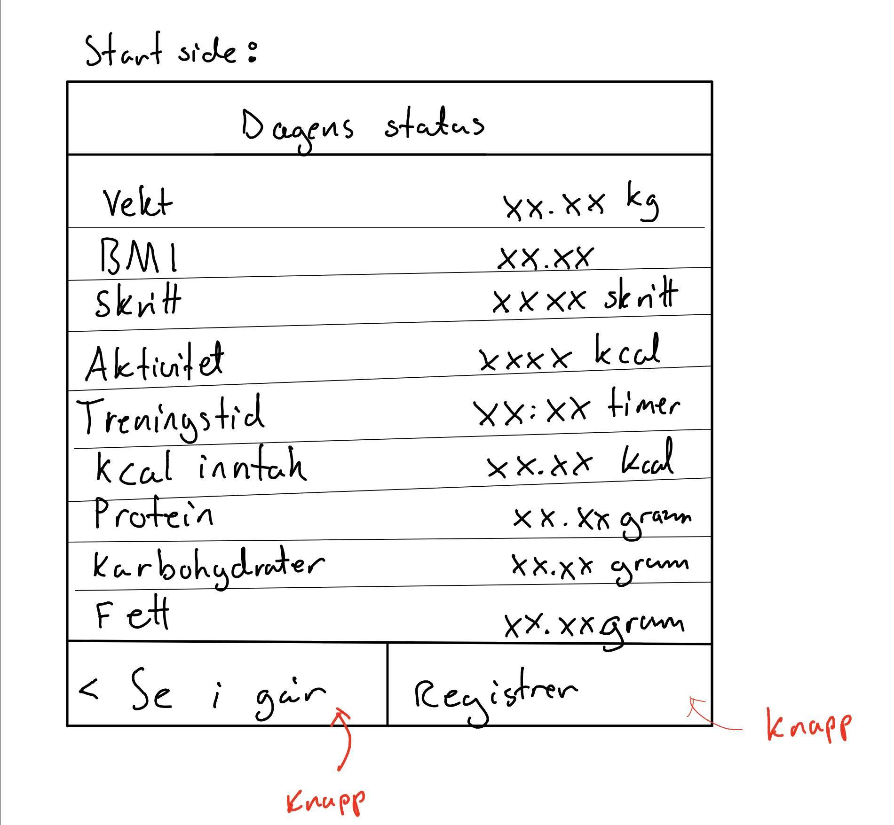
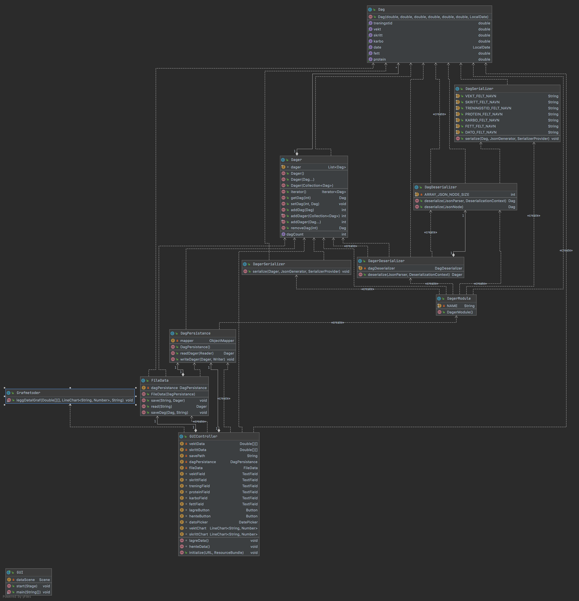
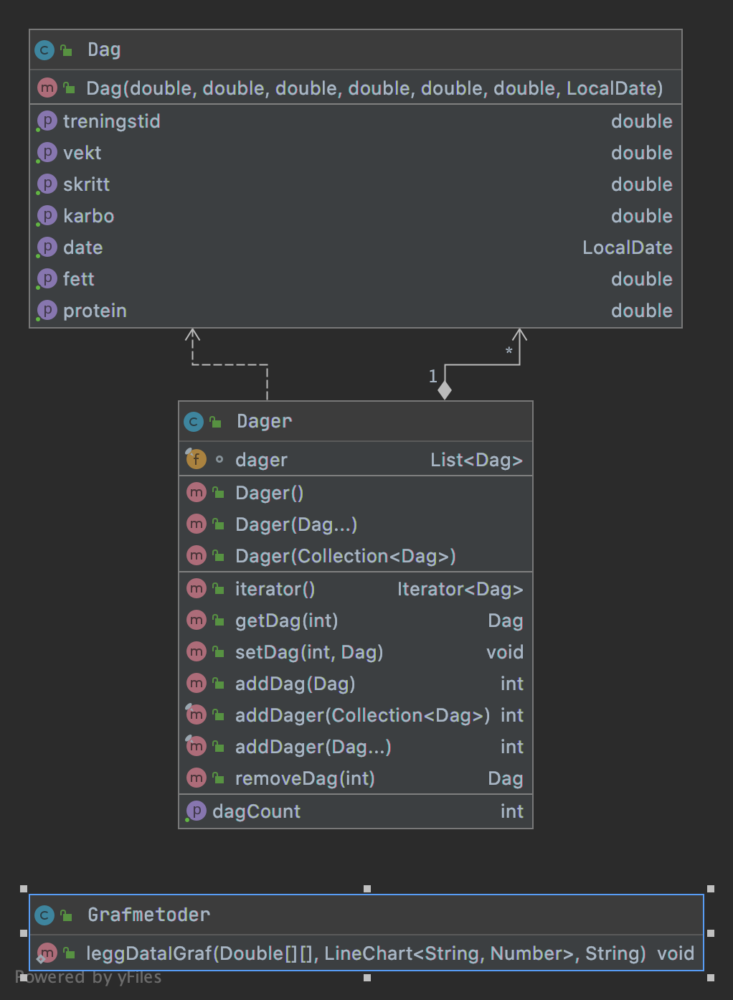
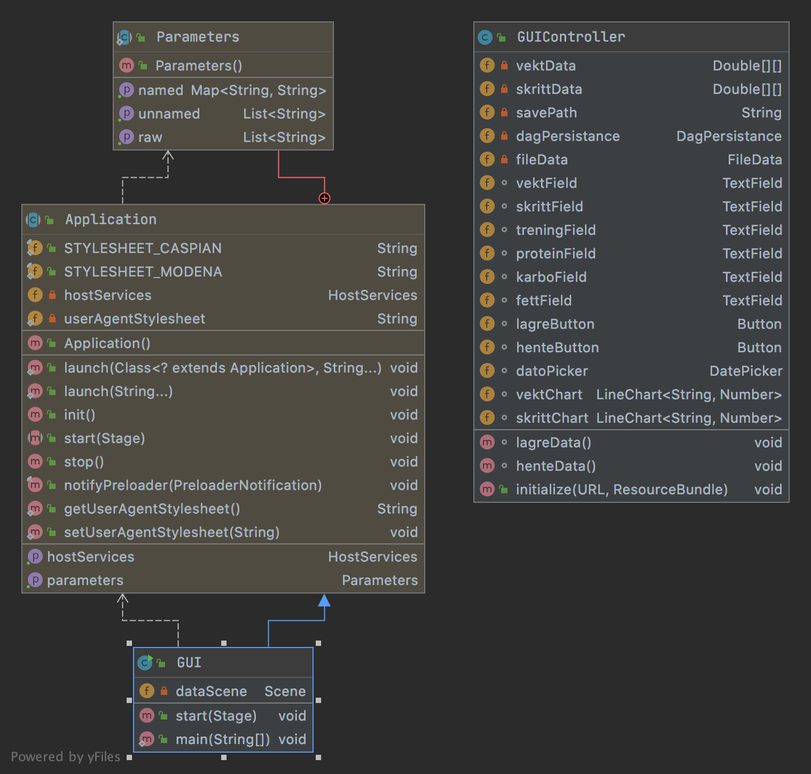
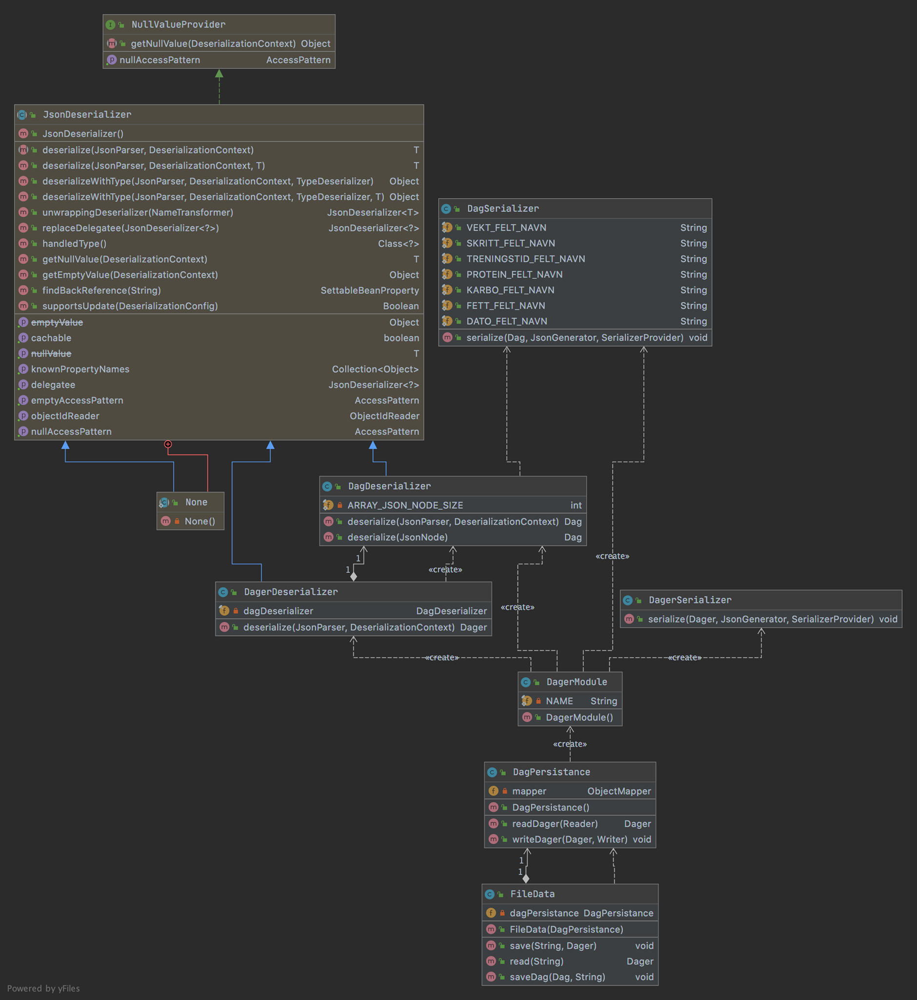

# helseapp

Dette er en app for å registrere og skaffe oversikt over ulike helsedata, 
slik som vekt, høyde,  skritt, treningstid, proteininntak, karbohydratinntak 
og fettinntak. 

## Brukerhistorier:
1. Som bruker ønsker jeg å registrere vekten min slik at jeg kan hente den frem senere
2. Som bruker ønsker jeg å registrere data for en valgt dato slik at jeg kan ha en historisk oversikt
3. Som bruker ønsker jeg å få en oversikt over vekten min for en gitt tidsperiode slik at jeg kan se fremgang
4. 5: Som bruker ønsker jeg å se en oversikt over alle dataene mine for en selvdefinert tidsperiode slik at jeg kan ha oversikt over utviklingen min
5. Som bruker ønsker jeg å kunne klikke meg fram og tilbake mellom dager samt å returnere til datoen i dag

## Mocukup
En mockup av hvordan vi så for oss at hovedsiden i appen skulle se ut fra starten. 

## Funksjonalitet

## Pakkediagram

## Klassediagram

UML-diagram for objektene i prosjektet:

UML-diagram for objektene i core-mappen:

UML-diagram for objektene i ui-mappen:

UML-diagram for objektene i json-mappen:

## Sekvensdiagram