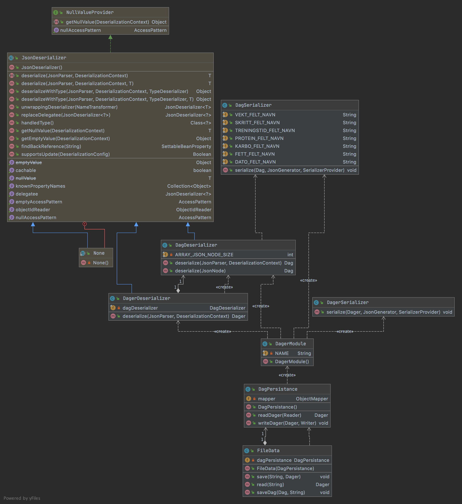

Denne mappen inneholder alle classer/filer som benyttes i fillagring. Koden er designet slik at det skal være mulig å 
skifte filformat og å gjøre store endringer i persistenslaget, uten at det skal være nødvendig å endre noe i de andre 
lagene. Filformatet som er valgt til dette prosjektet er json.

DagSerializer.java og DagerSerializer.java - Benyttes for serialisering av h.h.v. Dag og Dager -objekter til tekstrøm.

DagDeserializer.java og DagerDeserializer.java - Benyttes for deserialisering av tekstrøm til h.h.v. Dag og Dager 
-objekter.

DagerModule.java - Lager og initialiserer et simpleModule objekt, som er nødvendig for serialisering og deserialisering, 
med tilhørende serialisere og deserialisere

DagPersistance.java - Lager og konfigurerer et objectMapper object, som er nødvendig for serialisering og 
deserialisering.

FileData.java - Inneholder rene filhåndteringsmetoder(lagring/lesing) og logikk knyttet til lagring.

dager.json - Filen som benyttes til lagring

UML-diagram for objektene i json-mappen:
